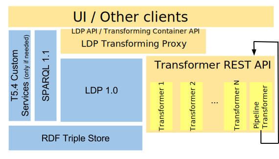

# Overall Architecture

The P3 Platform allows storing and retrieving RDF and non-RDF data as well extracting RDF and transforming unstructured data into RDF. It supports the Linked Data Platform (LDP) Standard and defines an extensible mechanism so that transformation to RDF and automatic metadata generation can be performed automatically when content is added to the platform.

## Components as applications

By default each component including all extractors are individual processes interaction via HTTP. An exception to this are the storage related components LDP, RDF Triple Store, SPARQL and the possible custom backend services which may be more tightly coupled. For these components the reference implementation will be based on Marmotta however it will also be possible to use Virtuoso.

## LDP Proxy

A crucial role is held by the P3 LDP Proxy. The Proxy allows to use any compliant LDP implementations and adds the P3 specific features. The proxy delegates the actual storing and Retrieving of RDF data to the proxied LDP instance but performs some additional actions on specially marked LDP Collections. Refer to the [Data extractor and importer with extraction API](data-extractor-importer-api.md) for the interaction with the extractors as well as the definition of data importing LDP Container.

## Deployment Infrastructure

Basically a component can run on any platform that can expose HTTP services. The components of the reference implementation may require some common runtimes readily available on windows as well as on the most popular UNIX derivates, e.g. Java or Node.js. Scripts are provided for startup on Unix Platforms.

## Extractor REST API

The [extractor services](data-extractor-importer-api.md) are accessed via a simple [Semantic REST API](architectural-principles.md) that works in both synchronous mode as well as in asynchronous mode. In the synchronous mode the respective request return immediately the result of the extraction, in the asynchronous mode the result of the extraction will be available at a later point in time at a different URI.

## Extracting Data Import API

This is an extensions of the LDP-Container (LDPC) defined in the LDP specification to allow to bind an extractor service to an LDPC. With this extension data added to the collection will be processed by a specific extractor. While this functionality could by provided by the LDP Server itself, w deiced to implement in in the LDP Proxy as to allow the usage of any LDP Server.

## Pipeline extractor

An important role plays the Pipeline extractor which processes the contents using a sequence of other extractors. While and LDPC itself can only be linked to one extractor, extractors of this type makes it nevertheless possible to have a whole sequence of extractors executed.
