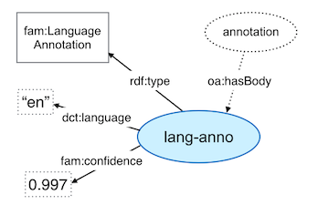
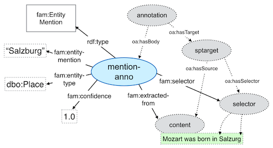
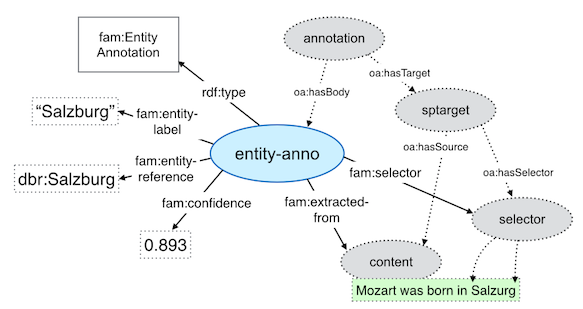
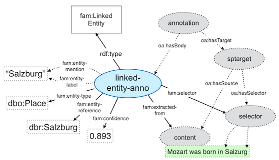
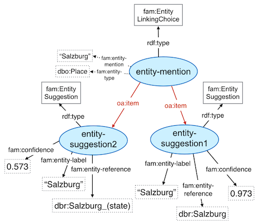
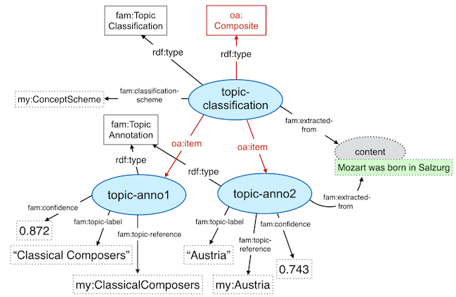
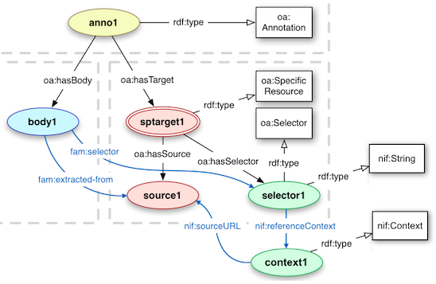

# Fusepool P3 Annotation Model

The Fusepool P3 Annotation Model is used by all Annotator implementations of the Fusepool Plattform. Annotators and transformers together build the components of the Transformation API.

Defining a commonly used model is core of enabling the use and configuration of Annotations workflows - piping different annotators together. It is also important for the consumption of annotation results.

## Usage

The Fusepool P3 Annotation Model is still being defined. All terms will be under the following normative namespace:

    http://vocab.fusepool.info/fam#

Behind that namespece there is not yet a proper RDF vocabulary/ontology defined. But it will be added in the upcoming weeks.

## Design Considerations

For the design of the Fusepool Annotation structure [Open Annotation](http://www.openannotation.org/spec/core/), [NIF 2.0](http://persistence.uni-leipzig.org/nlp2rdf/) and [FISE](http://stanbol.apache.org/docs/trunk/components/enhancer/enhancementstructure.html) where evaluated. 

Based on this evaluation the following design decisions where taken to base the Fusepool Annotation Model on Open Annotation. The main reason was that the high expressiveness of Open Annotation guarantees that all modeling requirements of envisioned usage scenario can be fulfilled. To reduce the additional complexity that comes along with the high expressiveness the Fusepool Annotation Model will introduce some "short cut" relations for typical access strategies (see the next sub-section for more details).

Instead of the Selectors provided by Open Annotation NIF will be used. This is not because NIF provides a better model for selectors, but mainly because by that Fusepool can also take advantage of the capability of formally representing lower level NLP processing results where needed. Doing so using OpenAnnotation is not practical because of the high amount of triples (compared to NIF).

Finally the Fusepool Annotation Model is defined so that Enhancements serialized by using the [Stanbol Enhancement Structure](http://stanbol.apache.org/docs/trunk/components/enhancer/enhancementstructure) can be transformed to the Fusepool model. This is a non functional requirement as existing Stanbol Enhancement Engiens will contribute a major part of the Fusepool transformation functionality.

The following sub-sections will go into details on some of the design considerations mentioned above.

### Expressiveness vs. ease of use 

Open Annotation defines is a very expressive model. While this allows to formulate very complex annotations it also comes with the disadvantage that one needs to follow a lot of indirections for extracting simple things. A good example is getting the selection for an annotation as this requires to traverse over 4 relations and 5 resources. The following listing shows the required relations and resources.

    (1) {annotation-body} <--oa:hasBody-- {annotation}
    (2) {annotation} --oa:hasTarget--> {specific-resource}
    (3) {specific-resource} --oa:hasSource--> {content}
    (4) {specific-resource} --oa:hasSelector--> {selector}
    (5) {selector} definitions
    
The Stanbol Enhancement Structure has a simpler model where annotation and selectors are merged to the same resource (a `fise:TextAnnotation`). Because of that the above request can be answered only by using the Text Annotation resource.

As a tradeoff between both the Fusepool Annotation Structure will define some shortcut relations between `{annotation-body}` and `{content}` as well as the `{selector}`. 

### Transformation from Stanbol Enhancement Structure

_TODO:_ provide more information or remove this subsection

The design of the Fusepool Annotation Model must ensure that a transformation from the [Stanbol Enhancement Structure](http://stanbol.apache.org/docs/trunk/components/enhancer/enhancementstructure) is possible. This ensures that all Enhancement Engines available for Apache Stanbol can be used as transformers in the Fusepool Plattform.

## Annotation Model

This section describes the Annotation Model as used by Fusepool. The annotation model is build upon a core that is fully compatible to Open Annotation. On top of this it defines multiple _Annotation Types_ that are used as `{annotation-body}` of the core models. _Annotation Types_ are extensible meaning that transformers capable of extracting information not covered by the _Annotation Types_ defined in this specification can define/use their own _Annotation Types_. For `{selector}` the Annotation Model preferes to use NIF 2.0 instead of the selectors provided by Open Annotation as this allows to nicely combine high level annotations - described by the different _Annotation Types_ - with lower level NLP annotation that are described much more efficient by NIF.

This chapter first provides the definition of the Annotation code followed by the definition of the different Annotation Types in their own sub-sections. The final section describes how to use NIF in combination with the Fusepool Annotation Model.

### Annotation Core

The core of the Fusepool Annotation Model is build upon [Open Annotation](http://www.openannotation.org/spec/core/). The following figure shows the Open Annotation annotation model including two additional relations as defined by the Fusepool Annotation Model.

As shown by the above figure each Fusepool Annotation has the following elements

* an `{annotation}` resource with the `rdf:type` `oa:Annotation`. This resource also holds all metadata about the annotation process including the provenance information.
* an `{annotation-body}` representing the actual annotation. Different annotation bodies are defined for different types of annotations (e.g. detected language, Named Entities, Linked Entities, Categorizations and Topics). The `fam:AnnotationBody` concept is used a parent concept for all different annotation types. This is also an extension point meaning that special Exractors can define their own annotation types.
* Fusepool always uses a `{sptarget}` - an resource with the `rdf:type` `oa:SpecificResource` as target of annotation. This `{sptarget}` resource is to represent the n-ary relation to the `{content}` ( `source` in Open Annotation terms) and the `{selector}`. 
* As `{selector}` for textual resources the model allows two options:
    1. Transformers can use a combination of the `oa:TextPositionSelector` and the `oa:TextQuoteSelector`. That means that the selector will both provide the start/end char offsets as well as the prefix, exact and suffix information.
    2. NIF 2.0 can be used as selector. The `nif:String` class also provides beginIndex/endIndex char offsets as well as before, anchorOf and after information. However NIF also allows to very efficiently encode NLP annotations. So in use cases where such information are required it is a better alternative to the selectors as provided by Open Annotation. For more information see the final section of this chapter. For compatibility reasons Transformer that do use NIF may also choose to add the properties of the Open Annotation selectors.

To make the consumption of the annotations easier the Fusepool Annotation Model defines the following two relations:

1. `fam:selector` defines a direct relation between the `{annotation-body}` and the `{selector}`. This property is used as shortcut for the following path in the  Open Annotation model: `{annotation-body} <--oa:hasBody-- {annotation} --oa:hasTarget--> {sptarget} --oa:hasSelector--> {selector}` 
2. `fam:extracted-from` defines a direct relation between the `{annotation-body}` and the `{content}`. This property is used as shortcut for the following path in the  Open Annotation model: `{annotation-body} <--oa:hasBody-- {annotation} --oa:hasTarget--> {sptarget} --oa:hasSource--> {content}`

Those two properties are essential for an easy consumption of Annotations assuming use cases that are driven by the annotation bodies. The following listing comparses SPARQL queries for the `{body}`, `{source}` and `{selector}`. To show the difference the first one only uses relations provided by Open Annotation while the second one is exploiting the `fam:selector` and `fam:extracted-from`.

    PREFIX oa: <http://www.w3.org/ns/oa#>

    SELECT ?body ?source ?selector
    WHERE {
        ?annotation a oa:Annotation ;
            oa:hasBody ?body ;
            oa:hasTarget ?sptarget .
        ?body a fam:TextAnnotation ;
            oa:hasBody ?body .
        ?sptarget oa:SpecificResource ;
            oa:hasSource ?source ;
            oa:hasSelector ?selector .
    }

Now the simplified version using `fam:selector` and `fam:extracted-from`:

    PREFIX oa: <http://www.w3.org/ns/oa#>
    PREFIX fam: <http://vocab.fusepool.info/fam#>
    
    SELECT ?body ?source ?selector
    WHERE {
        ?body a fam:TextAnnotation ;
            fam:extracted-from ?source ;
            fam:selector ?selector .
    }

It is also important to note that the 2nd query will execute much faster as it only requires three joins instead of nine.

Finally the core annotation modules also defines `fam:confidence` a property commonly used by all _Annotation Types_ defined in the following sections.
Values of this property are expected to be floating point values in the range [0 .. 1] where `0` represents the lowest confidence and `1` the highest. However values MUST BE interpreted as [Rational Scale](http://en.wikipedia.org/wiki/Ordinal_scale#Ordinal_scale) meaning that only =, ≠, > and < operations may be done on confidence values. This also means that assertion such as an Annotation with an confidence of `0.8` are twice as likely to be correct as one with `0.4` are not possible.  

### Language Annotation

A _Language Annotation_ (`fam:LanguageAnnotation`) is used to annotate the language of the parsed content or even the language of an part of the parsed content. The Stanbol Enhancement Structure uses a `fise:TextAnnotation` with the `dct:type` value `dct:LinguisticSystem` for this purpose. The detected language is provided as value of the `dct:language` property. As a `fise:TextAnnotation` is used it is also possible to define a sub-section within the processed document the language was detected for. 

In Fusepool Annotations that describe the language of the processed content are marked by the `fam:LanguageAnnotation` type. This annotation uses the `dct:language` property to provide the detected language.

The following figure shows an Language Annotation for English and an confidence of `0.997`

In the case that multiple language annotations are present for the same section in the text an `oa:Choice` can be used to formally represent the different options.

#### Example

The following listing provides an example for an annotation that the document `http://www.example.com/example.txt` is written in the English language.

    @prefix ex: <urn:fam-example:> .
    @prefix oa: <http://www.w3.org/ns/oa#> .
    @prefix fam: <http://vocab.fusepool.info/fam#> .
    @prefix nif: <http://persistence.uni-leipzig.org/nlp2rdf/ontologies/nif-core#> .

    ex:lang-anno-1 a fam:LanguageAnnotation ;
        dct:language "en";
        fam:confidence "0.9998"^^xsd;double ;
        fam:selector <http://www.example.com/example.txt#char=0> ;
        fam:extracted-from <http://www.example.com/example.txt> .

Note that this language annotation selects the whole document. This can be seen by the `RFC 5147` encoded URI using `#char=0`. The selector itself would explicitly define the selection of the whole text and look like shown in the following listing.
    
    <http://www.example.com/example.txt#char=0> a fam:NifSelector, nif:Context ;
        nif:sourceUrl <http://www.example.com/example.txt> ;
        nif:beginIndex "0"^^xsd:int ;
        nif:endIndex "1234"^^xsd:int .
    
Additionally there would also be an `oa:Annotation` and `oa:SpecialResource` providing additional meta information as defined by Open Annotation specification.

### Entity Mention Annotation

_Entity Mention Annotation_ (`fam:EntityMention`) are used to annotate mentions of entities in the text. Such annotations typically originate from the following type of transformers:

1. Named Entity Recognition (NER): NER is an Natural Language Processing (NLP) technique that detects the mentions of Named Entities of a given Types in texts. Both statistical and rule based systems are possible. NER extractors are usually trained for specific types of entities. Typically they do support Persons, Organizations and Locations but also other types such as Roles, Money, Date/Time ... are common.
2. Entity Lookup: In this case a component performs lookups of the text in some kind of controlled vocabulary (e.g. the list of employees, projects) and marks mentions of those Entities.

_NOTE:_ The Fusepool Annotation Model defines two sub-classes to _EntityMention_. First the `fam:LinkedEntity` - a combination of an `fam:EntityMention` and a `fam:EntityAnnotation` and second the `fam:EntityLinkingChoice` - a `oa:Choice` with several `fam:EntitySuggestion` options. The first is intended to be used in case a single entity can be linked with the mention. The second is used in cases where multiple entities could be linked and some further disambiguation step (e.g. a user interaction) is needed. See the section about _Entity Annotation_ for more information.

The _Entity Mention Annotation_ defines the following properties:

* `fam:entity-mention` [1..1]: The lexical form of the mention in the text. This is not necessarily the exact literal of the selected section in the text but is expected to represent the mentioned name of the Entity. Examples for deviations from the mention with the selection are due to lemmatization, case corrections, ...
* `fam:entity-type` [0..*]: the general type of the detected entity. Transformers are free to use any type. However it is recommended to use types form well known ontologies such as [NERD](http://nerd.eurecom.fr/ontology), [DBPedia](http://mappings.dbpedia.org/server/ontology/classes/), [Schema.org](http://schema.org/docs/full.html) or similar.

The following figure shows an example of a _Entity Mention Annotation_ for Salzburg detected as Named Entity with the type dbpedia Place in the sentence "Mozard was born in Salzburg"

 

The _Entity Mention Annotation_ provides direct relations to all information required for typical use cases. Most important the mention `Salzburg` and the type `dbp:Place` of the Named Entity. Also the content and the selector are directly linked. The full annotation structure as defined by Open Annotation is also available and shown by the dotted elements in the figure.

#### Example

The following Listing shows the `fam:EntityMention` annotation as depicted in the above figure:

    @prefix ex: <urn:fam-example:> .
    @prefix oa: <http://www.w3.org/ns/oa#> .
    @prefix fam: <http://vocab.fusepool.info/fam#> .
    @prefix nif: <http://persistence.uni-leipzig.org/nlp2rdf/ontologies/nif-core#> .
    @prefix dbo: <http://dbpedia.org/ontology/> .

    ex:ent-ment-anno-1 a fam:EntityMention ;
        fam:entity-type dbo:Place;
        fam:entity-mention "Salzuburg"@en
        fam:confidence "0.876"^^xsd;double ;
        fam:selector <http://www.example.com/example.txt#char=20,27> ;
        fam:extracted-from <http://www.example.com/example.txt> .

    <http://www.example.com/example.txt#char=20,27> a fam:NifSelector, nif:String ;
        nif:referenceContext <http://www.example.com/example.txt#char=0>
        nif:beginIndex "20"^^xsd:int ;
        nif:endIndex "27"^^xsd:int .
        
The above listing shows the `fam:EntityMention` as well as the NIF based `oa:Selector`. It omits the `oa:Annotation` and `oa:SpecialResource` instances.

### Entity Annotation

_Entity Annotation_ are used to link/suggest Entities from some controlled vocabulary. _Entity Annotation_ can be used for different kind of annotations:

1. _Keyword Annotation_ are typically used for Entity Tagging. This type does not define the actual mention(s) of the linked entities in the text. A _Keyword Annotation_ just defines that processed document is related to the linked Entity. A _Keyword Annotation_ is represented by a `fam:EntityAnnotation` that does not define a `oa:Selector`
2. _Linked Entity Annotation_ do link an Entity with a mention in the text. They are represented by the `fam:LinkedEntity` class defined as a subclass of `fam:EntityAnnotation` and `fam:EntityMention`.
3. In cases where multiple Entities could be linked to a mention a _Entity Linking Choice_ with multiple _Entity Suggestions_ can be used. The `fam:EntityLinkingChoice` is defined as subclass of both `fam:EntityMention` and `oa:Choice`. `fam:EntitySuggestion` instances are used to annotation all linking options. They are linked by the `oa:item` property from the `fam:EntityLinkingChoice`.

The following figure shows the base model of `fam:EntityAnnotation`

_Entity Annotation_ defines three specific properties:

1. `fam:entity-reference` [1..1]: This property references to the URI of the linked Entity. An _Entity Annotation_ is expected to have exactly a single value for that property.
2. `fam:entity-label` [1..n]: This property provides the label of the linked entity. It is recommended to use a label that fits the language of the processed text. If possible the label that was matching the mention in the text. While possible it is NOT recommended to add multiple labels for the Entity. The preferred way to provide additional information about linked Entities is to add them directly to the URI of the Entity - or in other words - to dereference (parts) of the Entity information.
3. `fam:entity-type` [0..n]: This property can be used to provide the type of the referenced Entity. In case the referenced Entity does have multiple types it is good practice to only include the most specific one. Note that the `fam:entity-type` is used for both _Entity Annotation_ and _Entity Mention Annotation_.

The following listing shows the RDF representation of a _Keyword Annotation_ for `dbr:Wolfgang_Amadeus_Mozart` as contained in the text used in the above figure.

    @prefix ex: <urn:fam-example:> .
    @prefix oa: <http://www.w3.org/ns/oa#> .
    @prefix fam: <http://vocab.fusepool.info/fam#> .
    @prefix nif: <http://persistence.uni-leipzig.org/nlp2rdf/ontologies/nif-core#> .
    @prefix dbo: <http://dbpedia.org/ontology/> .

    ex:keyword-anno-1 a fam:EntityAnnotation ;
        fam:entity-reference dbr:Wolfgang_Amadeus _Mozart ;
        fam:entity-type dbo:Person;
        fam:entity-label "Wolfgang Amadeus Mozart"@en ;
        fam:confidence "0.789"^^xsd;double ;
        fam:extracted-from <http://www.example.com/example.txt> .

Note that the _Keyword Annotation_ does not provide a selector. It only provides a link to the document `<http://www.example.com/example.txt>`. For _Entity Annotation_ variants that do provide information about the mention(s) of the linked entities see the following two sub sections.

#### Linked Entity Annotation

A _Linked Entity_ is an _Entity Mention_ that is linked with an Entity. The Fuespool Annotation Model defines `fam:LinkedEntity` as an subclass of `fam:EntityMention` and `fam:EntityAnnotation`. The following figure shows an example where 'Salzburg' as mentioned in the text is linked to the DBPedia resource `dbr:Salzburg`.

The above figure shows a single `{annotation-body}` typed as `fam:LinkedEntity` - meaning that the annotation is both a `fam:EntityMention` and a `fam:EntityAnnotation`. Annotators may also explicitly add those super types as convenience. Properties of both Annotation types are used to describe the Entity. In the shown example the `fam:entity-mention` and `fam:entity-label` do have the same value. However those values might be different (e.g. if the text mentions "1st Lieutenant" but the label of the Entity is "First lieutenant").

The following listing shows the RDF representation as depicted above

    @prefix ex: <urn:fam-example:> .
    @prefix oa: <http://www.w3.org/ns/oa#> .
    @prefix fam: <http://vocab.fusepool.info/fam#> .
    @prefix nif: <http://persistence.uni-leipzig.org/nlp2rdf/ontologies/nif-core#> .
    @prefix dbo: <http://dbpedia.org/ontology/> .

    ex:linked-entity-anno-1 a fam:LinkedEntity ;
        fam:entity-reference dbr:Salzburg ;
        fam:entity-type dbo:Place;
        fam:entity-mention "Salzuburg"@en ;
        fam:entity-label "Salzburg"@en ;
        fam:confidence "0.893"^^xsd;double ;
        fam:selector <http://www.example.com/example.txt#char=20,27> ;
        fam:extracted-from <http://www.example.com/example.txt> .

    <http://www.example.com/example.txt#char=20,27> a fam:NifSelector, nif:String ;
        nif:referenceContext <http://www.example.com/example.txt#char=0>
        nif:beginIndex "20"^^xsd:int ;
        nif:endIndex "27"^^xsd:int .
        
#### Entity Linking Choice Annotation

The _Entity Linking Choice Annotation_ is used in cases where multiple Entities are candidates to be linked with an _Entity Mention_. The `fam:EntityLinkingChoice` is defined as subclass of `fam:EntityMention` and the `oa:Choice` concept where all `oa:item` vales are of the `rdf:type` `fam:EntitySuggestion`. The `fam:EntitySuggestion` type is defined as subclass of `fam:EntityAnnotation`.

Those classes allows to formally describes first the mention and second multiple options for entities linked with this mention. Such an annotation will need an additional disambiguation step (e.g. a user interaction) to select the correct Entity to be linked with the mention. 

The following figure shows an example where the _Entities_ for the "City of Salzburg" and "Salzburg State" are suggested for the _Entity Mention_ "Salzburg" in the text. 

The figure shows a `fam:EntityLinkingChoice` with two `fam:EntitySuggestion`. Annotators may also explicitly add super types for those annotation bodies as convenience. Both `fam:EntitySuggestion` do have different `fam:confidence` values. Users need to sort suggestions based on their confidence to get an ordered list. In cases where one suggestion is very likely to be correct the annotator can use the `oa:default` property to point from the `fam:EntityLinkingChoice` to that suggestion (not shown in the figure).

The following listing shows the RDF representation of the annotations depicted above.

    @prefix ex: <urn:fam-example:> .
    @prefix oa: <http://www.w3.org/ns/oa#> .
    @prefix fam: <http://vocab.fusepool.info/fam#> .
    @prefix nif: <http://persistence.uni-leipzig.org/nlp2rdf/ontologies/nif-core#> .
    @prefix dbo: <http://dbpedia.org/ontology/> .

    ex:entity-linking-choice-anno-1 a fam:EntityLinkingChoice ;
        fam:entity-mention "Salzuburg"@en ;
        fam:entity-type dbo:Place;
        fam:confidence "0.973"^^xsd;double ;
        oa:item ex:entity-suggestion-1, ex:entity-suggestion-2 .
        fam:selector <http://www.example.com/example.txt#char=20,27> ;
        fam:extracted-from <http://www.example.com/example.txt> .

    ex:entity-suggestion-1 a fam:EntitySuggestion;
        fam:entity-reference dbr:Salzburg
        fam:entity-label "Salzuburg"@en ;
        fam:entity-type dbo:Place ;
        fam:confidence "0.973"^^xsd:double.
        fam:extracted-from <http://www.example.com/example.txt> .
        
    ex:entity-suggestion-2 a fam:EntitySuggestion;
        fam:entity-reference dbr:Salzburg_(state)
        fam:entity-label "Salzuburg"@en ;
        fam:entity-type dbo:Place ;
        fam:confidence "0.573"^^xsd:double.
        fam:extracted-from <http://www.example.com/example.txt> .
        
    <http://www.example.com/example.txt#char=20,27> a fam:NifSelector, nif:String ;
        nif:referenceContext <http://www.example.com/example.txt#char=0>
        nif:beginIndex "20"^^xsd:int ;
        nif:endIndex "27"^^xsd:int .
        

### Topic Classification

Classifying a content content is different to extracting entities. First because topics are typically not directly mentioned within the analysed text. So annotating mentions is not required. Second because the classification is often defined as an union over several defined topics weighted by their confidence.

To account for this the Fusepool Annotation Model defines two annotation bodies to describe a topic classification. The `fam:TopicClassification` is defined as a `oa:Composite` over [1..n] `fam:TopicAnnotation`. It can have an optional `oa:Selector`. If present the classification is only about the selected part of the content. If not present the classification is valid for the content as a whole. The _Topic Classification_ also allows to link the the used classification scheme. While it is recommended to use [SKOS](http://www.w3.org/2004/02/skos/) thesaurie as classification schemes the annotation model can also be used with other schemas and even label based schemes. Finally `fam:TopicAnnotation` are used to describe single topics of the classification. Those annotations do provide the `fam:confidence` as well as the name and optionally the uri of the topic. 

The following figure shows a _Topic Classification_ assigning two topics  - `my:ClassicalComposers` and `my:Austria` to the analysed content. Both topics contained in the `my:ConceptScheme`. The aim is to annodate that the content is about classical composers from Austria.

The `fam:TopicClassification` is defined as a subclass of `oa:Composite` where all `oa:item` are of type `fam:TopicAnnotation`. In addition all Topics linked by `fam:TopicAnnotation` are expected to be part of the classification scheme referenced by the `fam:classification-scheme` property. In case [SKOS](http://www.w3.org/2004/02/skos/) is used the `fam:classification-scheme` will refer to the `skos:ConceptScheme` instance and all topics need to be a member of that concept scheme. The depicted topic classification consists of two _Topic Annotation_ (`my:ClassicalComposers` and `my:Austria`) both part of the `my:ClassificationScheme`. 

For the annotation of extracted topics `fam:TopicAnnotation` are used. The `fam:topic-reference` is used to link to the URI of the topic (in case of SKOS a `skos:Concept` instance). The `fam:topic-label` holds the label of the topic. In case extracted topics are just defined by strings (and not formally defined as concepts) _Topic Annotation_ will just define the `fam:topic-label` property.

Additional information about linked _Topics_ should not be added to the _Topic Annotation_. If such information are desired they should be directly added to the URI of the linked _Topic_ - or in other words - used parts of the Thesaurie shall be dereferenced to the RDF graph with the annotations.

#### Example

The following listing provides the RDF representation of the Topic Classification as depicted above

    @prefix ex: <urn:fam-example:> .
    @prefix my: <http:www.example.org/thesaurus/music#> .
    @prefix oa: <http://www.w3.org/ns/oa#> .
    @prefix fam: <http://vocab.fusepool.info/fam#> .
    @prefix nif: <http://persistence.uni-leipzig.org/nlp2rdf/ontologies/nif-core#> .
    @prefix dbo: <http://dbpedia.org/ontology/> .

    ex:topic-classification-anno-1 a fam:TopicClassification ;
        fam:classification-scheme my:ConceptScheme ;
        fam:entity-type dbo:Place;
        oa:item ex:topic-anno-1, ex:topic-anno-2 .
        fam:selector <http://www.example.com/example.txt#char=0> ;
        fam:extracted-from <http://www.example.com/example.txt> .

    ex:ex:topic-anno-1 a fam:TopicAnnotation;
        fam:topic-reference my:ClassicalComposers ;
        fam:topic-label "Classical Composers"@en ;
        fam:confidence "0.872"^^xsd:double.
        fam:extracted-from <http://www.example.com/example.txt> .
        
    ex:topic-anno-2 a fam:TopicAnnotation;
        fam:topic-reference my:Austria ;
        fam:topic-label "Salzuburg"@en ;
        fam:confidence "0.743"^^xsd:double.
        fam:extracted-from <http://www.example.com/example.txt> .
        
    <http://www.example.com/example.txt#char=0> a fam:NifSelector, nif:Context ;
        nif:sourceUrl <http://www.example.com/example.txt> ;
        nif:beginIndex "0"^^xsd:int ;
        nif:endIndex "27"^^xsd:int .

Note that the selector `<http://www.example.com/example.txt#char=0>` is optional as it selects the whole content and defining no selector would implicitly also select the content as a whole. For completeness the next listing shows triples for the used concept scheme and topics.

    @prefix my: <http:www.example.org/thesaurus/music#> .
    @prefix skos: <http://www.w3.org/2004/02/skos/core#> .
    
    my:ConceptScheme a skos:ConceptScheme ;
        rdfs:label "My Music Concept Scheme".
       
    [..]
     
    my:ClassicalComposers a skos:Concept ;
        skos:inScheme my:ConceptScheme ;
        skos:prefLabel "Classical Composers"@en ;
        skos:prefLabel "Klassische Komponisten"@en ;
        skos:broader my:Composers .
    
    [..]
        
    my:Austria a skos:Concept ;
        skos:inScheme my:ConceptScheme ;
        skos:prefLabel "Austria"@en ;
        skos:prefLabel "Österreich"@de ;
        skos:broader my:Europe .
 

### NIF 2.0 Integration

This section provides information on how to use [NIF 2.0](http://persistence.uni-leipzig.org/nlp2rdf/) with the Fusepool Annotation Model. 

The integration between NIF 2.0 and the Open Annotation based Fuespool Annotation Model follows the recommendation of the _NIF OA_ (NIF Open Annotation) profile. As defined by this profile the main integration point between NIF and Open Annotation is the `oa:Selector`. The Fusepool Annotation Model defines the `fam:NifSelector` class to be used as `rdf:type` for such selectors. The `fam:NifSelector` is defined as subclass of both `oa:Selector` and `nif:String`.

The following figure outlines that integration with the Fusepool Annotation Model

Fusepool Annotation Bodies will refer to `fam:NifSelector` (both `oa:Selector` and `nif:String`) instances by using the `fam:selector` property. The selector  instance will provide the text selection information but may also provide additional NLP annotations like lemma, pos tag, sentiment values ...

NIF defines an elegant and also very efficient model for describing such NLP annotations. By only using a single `nif:Context` instance representing the text of the document as a whole and one `nif:String` instance for every annotation of a specific selection of the text.

The key feature that allows this is the usage of a fixed URI Scheme to generate unique identifier based on the selected text. By using such an URI Scheme different NLP annotation components writing annotations for the same selection are guaranteed to use the same resource identifier. So information written by such components will automatically be integrated on the RDF level. This feature is nicely shown in the following figure taken from the paper [Integrating NLP using Linked Data](http://svn.aksw.org/papers/2013/ISWC_NIF/public.pdf)

The same feature is also key for serializing the Fusepool Annotation Model as they just need to use available information about the selection to generate the `nif:String` instance used as `{selector}`

    <{source}#char=3,12>
        a fam:NifSelector, nif:String;
        nif:anchorOf favourite;
        nif:referenceContext <{source}#char=0>;
        nif:beginIndex "3"^^xsd:int;
        nif:endIndex "12"^^xsd:int;
        nit:before "My "@en
        nit:after " actress is Na"@en

Any other NLP annotation using the NIF format will be automatically be integrated with those `{selectors}` That means that the component generating the Fusepool Annotation Model is fully independent of any other components providing NIF annotations.

#### Example

The following listing shows an `fam:NifSelector` selecting 'Salzburg' at position [20,27] in the example.txt file. For having a complete example it also includes an _Entity Mention_ annotation.

    @prefix ex: <urn:fam-example:> .
    @prefix oa: <http://www.w3.org/ns/oa#> .
    @prefix fam: <http://vocab.fusepool.info/fam#> .
    @prefix nif: <http://persistence.uni-leipzig.org/nlp2rdf/ontologies/nif-core#> .
    @prefix dbo: <http://dbpedia.org/ontology/> .

    ex:ent-ment-anno-1 a fam:EntityMention ;
        fam:entity-type dbo:Place;
        fam:entity-mention "Salzuburg"@en
        fam:confidence "0.876"^^xsd;double ;
        fam:selector <http://www.example.com/example.txt#char=20,27> ;
        fam:extracted-from <http://www.example.com/example.txt> .

    <http://www.example.com/example.txt#char=20,27> a fam:NifSelector, nif:String ;
        nif:referenceContext <http://www.example.com/example.txt#char=0>
        nif:beginIndex "20"^^xsd:int ;
        nif:endIndex "27"^^xsd:int ;
        nif:anchorOf "Salzburg"@en ;
        nif:before "orn in "@en ;
        nif:after ". He was o"@en ;
        
    <http://www.example.com/example.txt#char=0> a nif:Context ;
        nif:sourceUrl <http://www.example.com/example.txt> ;
        nif:beginIndex "0"^^xsd:int ;
        nif:endIndex "1234"^^xsd:int .

## Transformation of FISE to the Fusepool Annotation Model

This section describes transformation instructions for the [FISE enhancement Structure]() to Open Anotation.

### fise:Enhancement transformation

`fise:Enhancement` instances are represented by `oa:Annotation`. This means that an `{annotation}` instance will be created. The following metadata are added to the `{annotation}` instance

* `dct:created` is mapped to `oa:annotatedAt`
* `dct:modified` is copied as is
* `dct:creator` is mapped to `oa:annotatedBy`
* `dct:contributor` is also mapped to `oa:annotatedBy`
* the `oa:serializedAt` property is set to the current time of the transformation
* the `oa:serializedBy` property is set to the enhancement engine performing the transformation

In addition a `{sptarget}` with the `rdf:type` `oa:SpecificResource` is created for each `fise:Enhancement`. The `fise:extracted-from` is mapped to `oa:hasSource` meaning that the URI of the _Content Item_ is set as source of the annotation.

### fise:TextAnnotation transformation

As `fise:TextAnnotation` are used in Stanbol for different annotation types for the Fusepool Annotation model the mappings are not only applied based on the type but also based on the values of other properties. This section will first describe general mapping rules and later define specific rules for different types in own sub-sections.

Every `fise:TextAnnotation` is also a `fise:Enhancement`. So based on the  [mapping rules for fise:Enhancements](#fiseenhancement_transformation) a `{annotation}` and a `{sptarget}` is created. The URI used by the `fise:TextAnnotation` is used for the `{annotation-body}` that is referenced by `oa:hasBody` from the `{annotation}`

`fise:TextAnnotation` may select parts of the content. This is indicated by the presence of both the `fise:start` and `fise:end` property. For all `fise:TextAnnotation` that define a selection a `{selector}` resource is created and linked with `oa:hasSelector` from the `{sptarget}`. 

For the `{selector}` there are two possible Options. First to generate a `oa:TextPositionSelector` and `oa:TextQuoteSelector` or second to use a [NIF 2.0](http://persistence.uni-leipzig.org/nlp2rdf/) selector. Both selectors do provide similar information but different properties are used.

In any case the URI of the `{selector}` is generated by appending a [RFC 5147](http://tools.ietf.org/html/rfc5147) based URI fragments - as used by [NIF 2.0](http://persistence.uni-leipzig.org/nlp2rdf/) - to the URI of the `{content-item}`

In case an OpenAnnotation selector is serialized the following mapping rules apply

* The `{selector}` uses the `rdf:type` `oa:TextPositionSelector` and `oa:TextQuoteSelector` types
* `fise:start` mapped to `oa:start`
* `fise:end` mapped to `oa:end`
* `fise:selected-text` mapped to `oa:exact`. _NOTE_ if `fise:selection-head` and `fise:selection-tail` are used instead of `fise:selected-text` they are copied to the selector and `oa:exact` will be missing.
* `fise:selection-prefix` mapped to `oa:prefix`
* `fise:selection-suffix` mapped to `oa:suffix`

In case an NIF 2.0 selector is serialized the following set of rules need to be used

* The `{selector}` uses the `rdf:type` `nif:String` and `fam:NifSelector`
* `fise:start` mapped to `nif:beginIndex`
* `fise:end` mapped to `oa:endIndex`
* `fise:selected-text` mapped to `nif:anchorOf`. _NOTE_ in case `fise:selection-head` and `fise:selection-tail` are used instead of `fise:selected-text` the `nif:head` and `nif:tail` properties must be used instead of `nif:anchorOf`.
* `fise:selection-prefix` mapped to `nif:before`
* `fise:selection-suffix` mapped to `nif:after`
* Add a `nif:referenceContext` relation to `<{content-item}#char=0>`. The `<{content-item}#char=0>` need to be created once for every `{content-Item}` with the following properties
    * `rdf:type` set to `nif:Context` and `nif:RFC5147String`. The second type specified the used URL Scheme for all `nif:String` instances using this as a `nif:referenceContext`.
    * `nif:sourceUrl` referring the `{content-item}`

Implementors may support an option to switch between both sets of rules. In some cases it might also make sense to use both mapping sets for compatibility reasons.

#### fam:LanguageAnnotation transformation

`fise:TextAnnotation` with the `dct:type` `dct:LinguisticSystem` are mapped to `fam:LanguageAnnotation` instances by using the following mappings:

* the `{annotation-body}` does use the `rdf:type` `fam:LanguageAnnotation`
* `dct:language` as defined by the `fise:TextAnnotation`
* `fise:confidence` mapped to `fam:confidence`

#### fam:TopicClassification transformation

`fise:TextAnnotation` with an incoming `dct:relation` from an `fise:TopicAnnotation` instance are mapped to `fam:TopicClassification` instances. In such cases the following mappings apply

* the `{annotation-body}` does use the `rdf:type` `fam:TopicClassification` and `oa:Sequence`
* the `fam:classification-scheme` property will not be set as this information is not available
* `fise:confidence` (if present) is mapped to `fam:confidence`

#### fam:EntityMention transformation

All remaining `fise:TextAnnotation` can be converted to `fam:EntityMention` instances. For this transformation the following mappings apply:

* `fise:selected-text` is mapped to `fam:entity-mention`
* `dct:type` is mapped to `fam:entity-type`
* `fise:confidence` is mapped to `fam:confidence`

_NOTE:_ that the `oa:Choice` and `fam:EntityLinkingChoice` types are added to the `fam:EntityMention` when mapping `fise:EntityAnnotation` instances.
    
### fise:EntityAnnotation transformation

In general all `fise:EntityAnnotation` instances are transformed to `fam:EntityAnnotation`.

Typically `fise:EntityAnnotation` are linked with `dct:related` to one or more `fise:TextAnnotation`. Those `fise:TextAnnotation` define the mentions of the Entity in the analysed text. In FISE Entity Annotation do not define their own selector as the selection is provided by the linked Entity Annotation. Open Annotation does use a different model, where the `{annotation-body}` for the `fam:EntityAnnotation` will link to all `{selector}` instances for its mentions. Based on the mapping rules for [Entity Annotation](#fiseentityannotation_transformation) such `{selector}` instances are already written and SHOULD BE reused while transforming the `fise:EntityAnnotation`

When transforming `fise:EntityAnnotation` one needs also to modify `fam:EntityMention` for linked `fise:TextAnnotation`. For that it is important to not that those `fam:EntityMention` instances will use the same URIs as the original `fise:TextAnnotation`. So when transforming `fise:EntityAnnotation` one needs to add the `oa:Choice` and `fam:EntityLinkingChoice` types to `fam:EntityMention` with the same URI as `fise:TextAnnotation` referenced with the `dct:relation` property. One needs also to write a `oa:item` relation between those `fam:EntityMention` instances and the transformed `fam:EntityAnnotation`.

Optionally it is possible to represent `fise:TextAnnotation` instances that do only have a single linked `fise:EntityAnnotation` as `fam:LinkedEntity`. In this case the `fam:EntityMention` already created for the `fise:TextAnnotation` is modified by adding the `fam:LinkedEntity` type. The same resource - using the URI of the original `fise:TextAnnotation` will also be used as subject for the mapping of the `fise:EntityAnnotation`.  

In the following are the complete transformation rules for `fise:EntityAnnotation` instances:

1. Every `fise:EntityAnnotation` is also a `fise:Enhancement`. So based on the  [mapping rules for fise:Enhancements](#fiseenhancement_transformation) a `{annotation}` and a `{sptarget}` is created. The `{sptarget}` links with the `oa:hasSource` to the URI of the `{content-item}`. At this stage no `{selector}` are created.
2. The URI used by the `fise:EntityAnnotation` is used for the `{annotation-body}` that is referenced by `oa:hasBody` from the `{annotation}`. The `{annotation-body}` gets the `rdf:type` `fam:EntityAnnotation`. The following property mappings apply for the `{annotation-body}`
    * `fise:entity-reference` is mapped to `fam:entity-reference`
    * `fise:entity-label` is mapped to `fam:entity-label`
    * `fise:entity-type` is not mapped as the new annotation model does not provide type information as part of the `fam:EntityAnnotation`. Implementors may provide an option to copy `fise:entity-type` values over to the `fam:EntityAnnotation`.
    * if present the `entityhub:site` property referring the Entityhub site holding the controlled vocabulary is copied over to the `fam:EntityAnnotation`.
    * `fise:confidence` is mapped to `fam:confidence`
    * `fise:extracted-from` is mapped to `fam:extracted-from`. It provides a shortcut from the `{annotation-body}` to the `{content-item}`
3. For all `fise:TextAnnotation` instances linked via `dct:related` the following transformations need to be preformed
    * The `rdf:type` `oa:Choice` has to be added to the `fam:EntityMention` with the same URI as the processed `fise:TextAnnotation`
    * The `fam:TextAnnotation` with the same URI as the processed `fise:TextAnnotation` needs to be connected to the `fam:EntityAnnotation` by using `oa:item`.
    * All `{selector}` instances referenced by the `fam:EntityMention` with the same URI as the processed `fise:TextAnnotation` need also to be referenced with both `{sptarget} oa:hasSelector {selector}` and `{annotation-body} fam:selector {selector}`. This ensures that the `fam:EntityAnnotation` defines selector for all its mentions in the analyzed text
    
### fise:TopicAnnotation transformation

FISE uses `fise:TopicAnnotation` instances linked to a `fise:TextAnnotation` for representing topic classifications of a document (or parts of a document if the Text Annotation selects parts of the text). The Fusepool Annotation Model defines the `fam:TopicClassification` and the `fam:TopicAnnotation` for that purpose.

Mapping rules for `fise:TextAnnotation` with linked `fise:TopicAnnotation` to `fma:TopicClassification` are already define in an [earlier section](#famTopicClassification_transformation). This section specifies how to transform the `fise:TopicAnnotation` to `fam:TopicAnnotation` instances.

In the following are the complete transformation rules for `fise:TopicAnnotation` instances:

1. Every `fise:TopicAnnotation` is also a `fise:Enhancement`. So based on the  [mapping rules for fise:Enhancements](#fiseenhancement_transformation) a `{annotation}` and a `{sptarget}` is created. The `{sptarget}` links with the `oa:hasSource` to the URI of the `{content-item}`. At this stage no `{selector}` are created.
2. The URI used by the `fise:TopicAnnottion` is used for the `{annotation-body}` that is referenced by `oa:hasBody` from the `{annotation}`. The `{annotation-body}` gets the `rdf:type` `fam:TopicAnnotation`. The following property mappings apply for the `{annotation-body}` 
    * `fise:entity-reference` is mapped to `fam:topic-reference`
    * `fise:entity-label` is mapped to `fam:topic-label`
    * `fise:entity-type` is not mapped as the new annotation model does not provide type information as part of the `fam:TopicAnnotation`. Implementors may provide an option to copy `fise:entity-type` values over to the `fam:EntityAnnotation`.
    * if present the `entityhub:site` property referring the Entityhub site holding the thesaurus.
    * `fise:confidence` will also be added to the `{annotation-body}`
    * `fise:extracted-from` is mapped to `fam:extracted-from`. It provides a shortcut from the `{annotation-body}` to the `{content-item}`
3. For all `fise:TopicAnnotation` instances linked via `dct:related` the following transformations need to be preformed
    * This expects that a `fam:TopicClassification` was already created for the URI of the linked `fise:TextAnnotation`. If this is not the case this transformation has to be performed as described in the [fam:TopicClassifcation transformation](#famTopicClassification_transformation) section.
    * The `fam:TopicClassification` needs to be connected to the `fam:EntityAnnotation` by using `oa:item`
    * All `{selector}` instances referenced by the `fam:TopicClassification` need also to be referenced with both `{sptarget} oa:hasSelector {selector}` and `{annotation-body} fam:selector {selector}`. This ensures that the `fam:TopicAnnotation` defines the selector for the classified part of the document.

